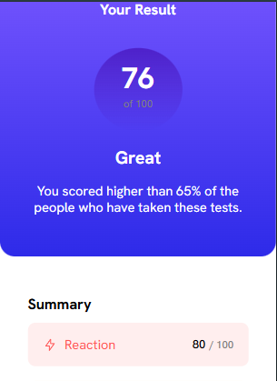
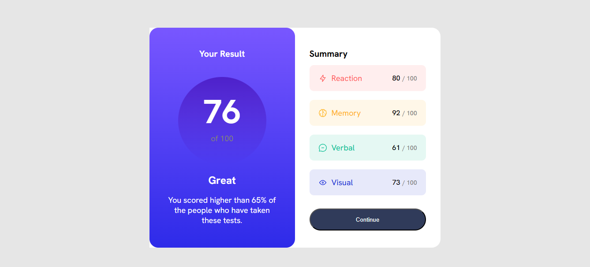
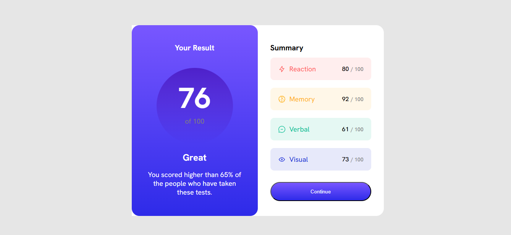

# Frontend Mentor - Results summary component solution

This is a solution to the [Results summary component challenge on Frontend Mentor](https://www.frontendmentor.io/challenges/results-summary-component-CE_K6s0maV). Frontend Mentor challenges help you improve your coding skills by building realistic projects. 

## Table of contents

- [Overview](#overview)
  - [The challenge](#the-challenge)
  - [Screenshot](#screenshot)
  - [Links](#links)
- [My process](#my-process)
  - [Built with](#built-with)
  - [What I learned](#what-i-learned)
  - [Useful resources](#useful-resources)
- [Author](#author)

**Note: Delete this note and update the table of contents based on what sections you keep.**

## Overview

### The challenge

Users should be able to:

- View the optimal layout for the interface depending on their device's screen size
- See hover and focus states for all interactive elements on the page

### Screenshot






### Links

- Solution URL: [Add solution URL here](https://www.frontendmentor.io/solutions/responsive-results-summary-component-using-css-grid-and-flexbox-JSCjSgS_p4)
- Live Site URL: [Add live site URL here](https://ahmed-adjei1.github.io/Result-Summary-Component/)

## My process

### Built with

- Semantic HTML5 markup
- CSS custom properties
- Flexbox
- CSS Grid
- Desktop-first workflow

**Note: These are just examples. Delete this note and replace the list above with your own choices**

### What I learned

- CSS gradient


```css
.result {
	background-image: linear-gradient(hsl(252, 100%, 67%), hsl(241, 81%, 54%));
}
```


### Useful resources

- [w3schools](https://www.w3schools.com/css/css3_gradients.asp) - This helped me learn gradient.


## Author

- Frontend Mentor - [@Ahmed-Adjei](https://www.frontendmentor.io/profile/Ahmed-Adjei1)
- Twitter - [@King Ahmed](https://x.com/KingAhm92896393)
